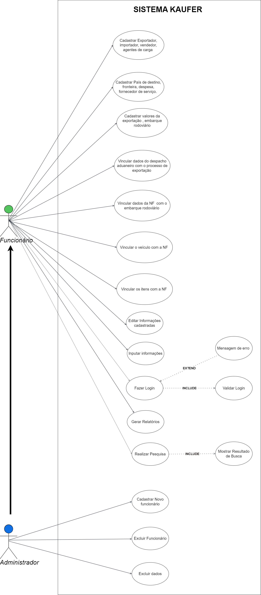

# Especificações do Projeto

Pré-requisitos: <a href="1-Documentação de Contexto.md"> Documentação de Contexto</a>

Definição do problema e ideia de solução a partir da perspectiva do usuário. É composta pela definição do  diagrama de personas, histórias de usuários, requisitos funcionais e não funcionais além das restrições do projeto.

Apresente uma visão geral do que será abordado nesta parte do documento, enumerando as técnicas e/ou ferramentas utilizadas para realizar a especificações do projeto

## Arquitetura e Tecnologias

A arquitetura de software utilizada em nosso projeto é o MVC. Usaremos as seguintes tecnologias:

|Função   | Tecnologia utilizada  |
|---------|-----------------------|
|IDE      |Visual Studio  |
|Linguagens utilizadas no front-end | HTML, CSS, Javascript|
|Linguagens utilizadas no back-end  | C#|
|Frameworks |Bootstrap, Asp.Net.,  Entity Framework|
|Banco de dados| Microsoft SQL Server|

## Project Model Canvas

## Requisitos

As tabelas que se seguem apresentam os requisitos funcionais e não funcionais que detalham o escopo do projeto. Para determinar a prioridade de requisitos, aplicar uma técnica de priorização de requisitos e detalhar como a técnica foi aplicada.

### Requisitos Funcionais

|ID    | Descrição do Requisito  | Prioridade |
|------|-----------------------------------------|----|
|RF-001| O sistema deve permitir ao usuário realizar o login   | ALTA | 
|RF-002|O sistema deve permitir ao gestor cadastrar o usuário | ALTA | 
|RF-003|O sistema deve permitir ao usuário cadastrar o importador | ALTA | 
|RF-004|O sistema deve permitir ao usuário cadastrar o exportador| ALTA | 
|RF-005|O sistema deve permitir ao usuário cadastrar o vendedor | ALTA | 
|RF-006|O sistema deve permitir ao usuário cadastrar o Agente de Carga   | ALTA | 
|RF-007|O sistema deve permitir ao usuário cadastrar o País de Destino     | ALTA |
|RF-008|O sistema deve permitir ao usuário cadastrar a Fronteira | ALTA |
|RF-009|O sistema deve permitir ao usuário cadastrar as despesas | ALTA |
|RF-010|O sistema deve permitir o usuário cadastrar o fornecedor de serviço  | ALTA |
|RF-011|O sistema deve permitir o usuário cadastrar os documentos de exportação  | ALTA |
|RF-012|O sistema deve permitir o usuário cadastrar os valores da Exportação | ALTA |
|RF-013|O sistema deve permitir que o usuário vincule as despesas com o processo de exportação | ALTA |
|RF-014|O sistema deve permitir que o usuário vincule os dados do despacho aduaneiro com o processo de exportação | ALTA |
|RF-015|O sistema deve permitir ao usuário cadastrar embarques rodoviários|ALTA|
|RF-016|O sistema deve permitir que o usuário vincule a nota fiscal com o embarque rodoviário| ALTA|
|RF-017|O sistema deve permitir que o usuário vincule veículos com as notas ficais| ALTA |
|RF-018|O sistema deve permitir que o usuário vincule os itens nas notas fiscais do embarque rodoviário| ALTA | 
|RF-019|O sistema deve gerar relatório em excel do processo  | ALTA | 
|RF-020|O sistema de permitir o usuário cadastrar o status do processo | ALTA | 

### Requisitos não Funcionais

|ID     | Descrição do Requisito  |Prioridade |
|-------|-------------------------|----|
|RNF-001| O sistema deve ser responsivo para rodar em um dispositivos móvel | MÉDIA | 
|RNF-002| Deve processar requisições do usuário em no máximo 3s |  BAIXA | 
|RNF-003| O sistema deve conter uma verificação de duas etapas utilizando o email cadastrado |  MÉDIA | 
|RNF-004| A senha deve ser criptografada no banco de dados |  ALTA | 

## Restrições

O projeto está restrito pelos itens apresentados na tabela a seguir.

|ID| Restrição                                             |
|--|-------------------------------------------------------|
|01| O projeto deverá ser entregue até o final do semestre |
|02| A equipe não deve subcontratar o desenvolvimento do trabalho |
|03| o aplicativo deve se restringir as tecnologias descritas neste repositório |

## Diagrama de Casos de Uso

O diagrama de casos de uso é o próximo passo após a elicitação de requisitos, que utiliza um modelo gráfico e uma tabela com as descrições sucintas dos casos de uso e dos atores. Ele contempla a fronteira do sistema e o detalhamento dos requisitos funcionais com a indicação dos atores, casos de uso e seus relacionamentos. 

## Modelo ER (Projeto Conceitual)

O Modelo ER representa através de um diagrama como as entidades (coisas, objetos) se relacionam entre si na aplicação interativa.

## Diagrama de Classes 

.png)

## Projeto da Base de Dados

