# Planos de Testes de Software

Apresente os cenários de testes utilizados na realização dos testes da sua aplicação. Escolha cenários de testes que demonstrem os requisitos sendo satisfeitos.

Enumere quais cenários de testes foram selecionados para teste. Neste tópico o grupo deve detalhar quais funcionalidades avaliadas, o grupo de usuários que foi escolhido para participar do teste e as ferramentas utilizadas.

| **Caso de teste**   | **CT-01-Tela Login** |
|:---:	|:---:	|
|Requisito Associado |  RF-001 - O sistema deve permitir ao usuário realizar o login.| 
| Objetivo do Teste 	| O usuário deverá realizar o login.|
| Passos 	| - Acessar o aplicativo   - Digitar email e senha   - Clicar no botão 'login' |  
|Critério de Êxito | - Verificar se o usuário conseguiu se conectar a sua conta  .|
|  |  |
| **Caso de teste**   | **CT-02-Tela Cadastro do Usuário** |
|Requisito Associado |  RF-002 - O sistema deve permitir ao gestor cadastrar o usuário. | 
| Objetivo do Teste 	| O Gestor deverá realizar o seu cadastro e o cadastro do colaborador.|
| Passos 	| - Acessar o Site  - Digitar nome, e-mail, senha, CPF, Tipo de Usuário   - Clicar no botão 'Enviar cadastro' |  
|Critério de Êxito | - O cadastro do usuário deve ser realizado.|
|  |  |
| **Caso de teste**   | **CT-03-Tela Cadastro de importador** |
|Requisito Associado |  RF-003 - O sistema deve permitir ao usuário cadastrar o importador. | 
| Objetivo do Teste 	| O usuário deverá realizar o cadastro do importador.|
| Passos 	| - Acessar o Site  - Digitar sigla, tipo, nome, endereço, cidade, estado, país, CEP, Telefone, Email, CNPJ, Contato e observações   - Clicar no botão 'Enviar cadastro' |  
|Critério de Êxito | - O cadastro do importador deve ser realizado.|
|  |  |
| **Caso de teste**   | **CT-04-Tela Cadastro de exportador** |
|Requisito Associado |  RF-004 - O sistema deve permitir ao usuário cadastrar o exportador. | 
| Objetivo do Teste 	| O usuário deverá realizar o cadastro do exportador.|
| Passos 	| - Acessar o Site  - Digitar sigla, tipo, nome, endereço, cidade, estado, país, CEP, Telefone, Email, CNPJ, Contato e observações   - Clicar no botão 'Enviar cadastro' |  
|Critério de Êxito | - O cadastro do exportador deve ser realizado.|
|  |  |
| **Caso de teste**   | **CT-05-Tela Cadastro do Vendedor** |
|Requisito Associado |  RF-005 - O sistema deve permitir ao usuário cadastrar o vendedor.
| Objetivo do Teste 	| O usuário deverá realizar o cadastro do vendedor.|
| Passos 	| - Acessar o Site  - Digitar nome   - Clicar no botão 'Enviar cadastro' |  
|Critério de Êxito | - O cadastro do vendedor deve ser realizado.|
|  |  |
| **Caso de teste**   | **CT-06-Tela Agente de Carga** |
|Requisito Associado |  RF-006 - O sistema deve permitir ao usuário cadastrar o Agente de Carga. | 
| Objetivo do Teste 	| O usuário deverá cadastrar e editar o Agente de Carga.|
| Passos 	| - Acessar o Site  - Fazer o login   - Em cadastro de Agente de Carga digitar a Razão Social   - Clicar no botão 'Enviar cadastro'   - Alterar a Razão Social do Agente de Carga    - Clicar em Editar  |  
|Critério de Êxito | - O cadastro do Agente de Carga deve ser realizado e depois deve ser editado.|
|   |   |
| **Caso de teste**   | **CT-07-Tela Cadastro de Destino** |
|Requisito Associado | RF-007 - O sistema deve permitir ao usuário cadastrar o País de Destino | 
| Objetivo do Teste 	| O usuário deverá cadastrar e editar o País de Destino.|
| Passos 	| - Acessar o Site  - Fazer o login   - Em cadastro de Destino digitar o nome do País   - Clicar no botão 'Enviar cadastro'   - Para editar, acessar a página de edição   - Alterar o nome do País    - Clicar em Editar  |  
|Critério de Êxito | - O cadastro do País de Destino deve ser realizado e depois deve ser editado.|
|   |   |
| **Caso de teste**   | **CT-08-Tela Cadastro de Fronteira** |
|Requisito Associado | RF-008 - O sistema deve permitir ao usuário cadastrar a Fronteira | 
| Objetivo do Teste 	| O usuário deve cadastrar e editar a Fronteira.|
| Passos 	| - Acessar o Site  - Fazer o login   - Em cadastro de Fronteira digitar o nome da fronteira   - Clicar no botão 'Adicionar'   - Para editar, acessar a página de edição   - Alterar o nome da Fronteira    - Clicar em Salvar  |  
|Critério de Êxito | - O cadastro da fronteira deve ser realizado e deve ser permitido a edição|
|   |   |
| **Caso de teste**   | **CT-09-Tela Cadastro de despesas** |
|Requisito Associado |  RF-009 - O sistema deve permitir ao usuário cadastrar as despesas. | 
| Objetivo do Teste 	| O usuário deverá realizar o cadastro de despesas.|
| Passos 	| - Acessar o Site  - Digitar o nome da despesa   - Clicar no botão 'Enviar cadastro' |  
|Critério de Êxito | - O cadastro da despesa deve ser realizado.|
|  |  |
| **Caso de teste**   | **CT-10-Tela Cadastro de fornecedor de serviços** |
|Requisito Associado |  RF-010 - O sistema deve permitir o usuário cadastrar o fornecedor de serviço. | 
| Objetivo do Teste 	| O usuário deverá realizar o cadastro de fornecedor de serviços.|
| Passos 	| - Acessar o Site  - Digitar o nome do fornecedor, tipo de serviço   - Clicar no botão 'Enviar cadastro' |  
|Critério de Êxito | - O cadastro do fornecedor de serviços deve ser realizado.|
|  |  |
| **Caso de teste**   | **CT-12-Tela Cadastro de Valores** |
|Requisito Associado |  RF-012 - O sistema deve permitir o usuário cadastrar os valores da Exportação.
| Objetivo do Teste 	| O usuário deverá realizar o cadastro dos valores de exportação.|
| Passos 	| - Acessar o Site  - Digitar os valores da exportação   - Clicar no botão 'Enviar cadastro' |  
|Critério de Êxito | - O cadastro dos valores da exportação deve ser realizado.|
|   |   |
| **Caso de teste**   | **CT-13-Tela Cadastro de DCE** |
|Requisito Associado |  RF-013 - O sistema deve permitir que o usuário vincule as despesas com o processo de exportação. | 
| Objetivo do Teste 	| O usuário deverá realizar o cadastro de DCE.|
| Passos 	| - Acessar o Site  - Digitar a despesa, valor e observação   - Clicar no botão 'Enviar cadastro' |  
|Critério de Êxito | - O cadastro da DCE deve ser realizado.|
|  |  |
| **Caso de teste**   | **CT-14-Tela Cadastro de Despacho** |
|Requisito Associado | RF-014 - O sistema deve permitir que o usuário vincule os dados do despacho aduaneiro com o processo de exportação  | 
| Objetivo do Teste 	| O usuário deverá cadastrar e editar os dados do despacho aduaneiro e vincular ao processo de exportação.|
| Passos 	| - Acessar o Site  - Fazer o login   - Em cadastro de Despacho digitar o dados indicados e o código do processo ao qual está vinculado   - Clicar no botão 'Enviar cadastro'   - Para editar, acessar a página de edição   -  Alterar os dados    - Clicar em Editar  |  
|Critério de Êxito | - O cadastro dos dados de despacho deve ser realizado e depois deve ser editado.|
|   |   |
| **Caso de teste**   | **CT-21-Tela Cadastro de Despachante** |
|Requisito Associado |  RF-021 - O sistema deve permitir ao usuário cadastrar o Despachante.
| Objetivo do Teste 	| O usuário deverá realizar o cadastro do Despachante.|
| Passos 	| - Acessar o Site  - Digitar nome do Despachante   - Clicar no botão 'Enviar cadastro' |  
|Critério de Êxito | - O cadastro do Despachante deve ser realizado.|
|   |   |
| **Caso de teste**   | **CT-22-Tela Cadastro de Processo** |
|Requisito Associado |  RF-022 - O sistema deve permitir ao usuário cadastrar o Processo de exportação.
| Objetivo do Teste 	| O usuário deverá realizar o cadastro dos dados do processo de exportação .|
| Passos 	| - Acessar o Site  - Digitar os dados do processo.   - Clicar no botão 'Enviar cadastro' |  
|Critério de Êxito | - O cadastro do Processo deve ser realizado.|
|   |   |
| **Caso de teste**   | **CT-20-Tela Cadastro de Status** |
|Requisito Associado |  RF-020 - sistema deve permitir ao usuário cadastrar o Status do Processo.
| Objetivo do Teste 	| O usuário deverá realizar o cadastro dos Status .|
| Passos 	| - Acessar o Site  - Digitar o Status.   - Clicar no botão 'Enviar' |  
|Critério de Êxito | - O cadastro do Status deve ser realizado.|

# Evidências de Testes de Software

Apresente imagens e/ou vídeos que comprovam que um determinado teste foi executado, e o resultado esperado foi obtido. Normalmente são screenshots de telas, ou vídeos do software em funcionamento.

CT-02-Tela Cadastro do Usuário
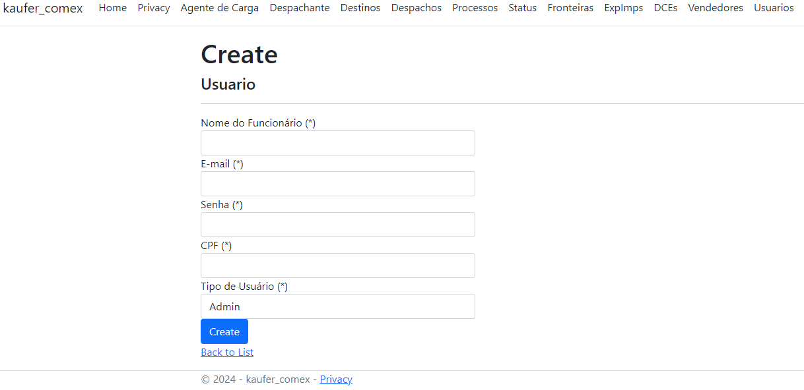
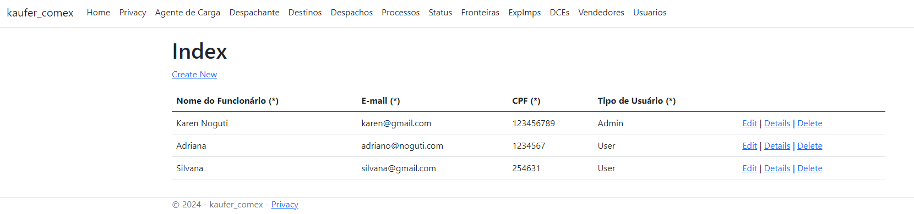

CT-03 e 04-Tela Cadastro de importador e exportador
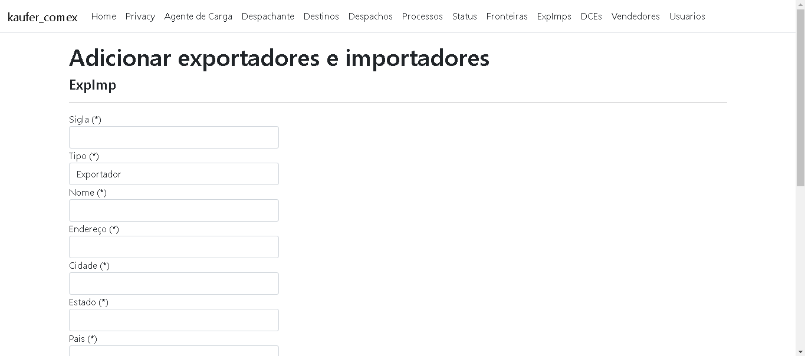
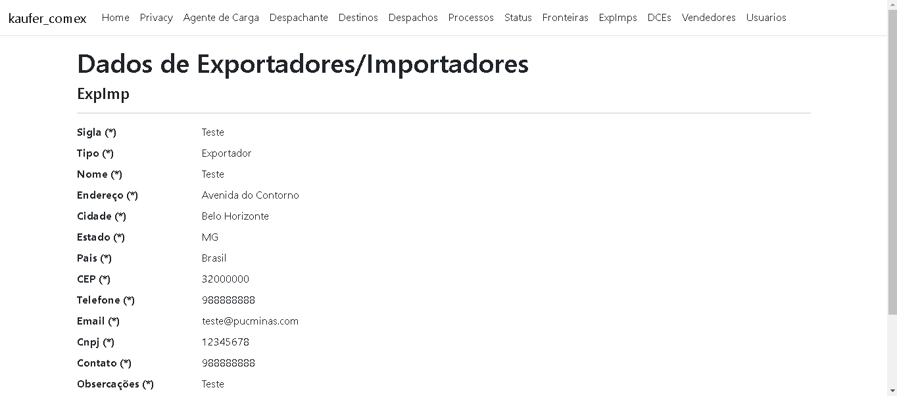

CT-05-Tela Cadastro do Vendedor
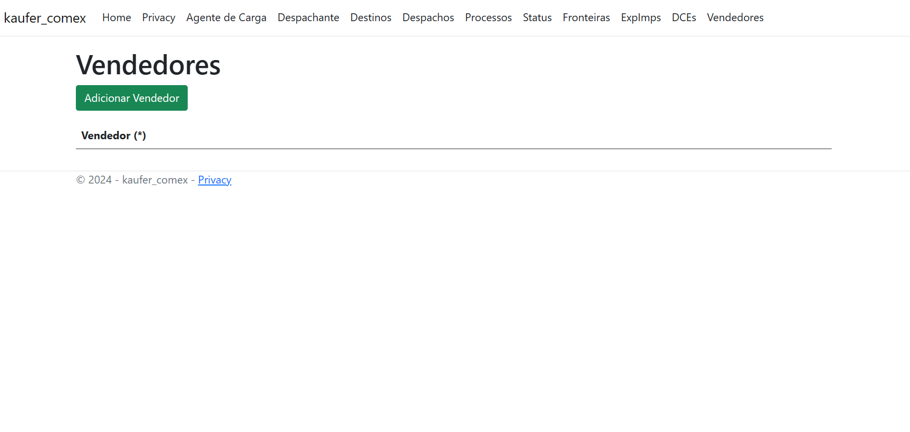

CT-06-Tela Agente de Carga
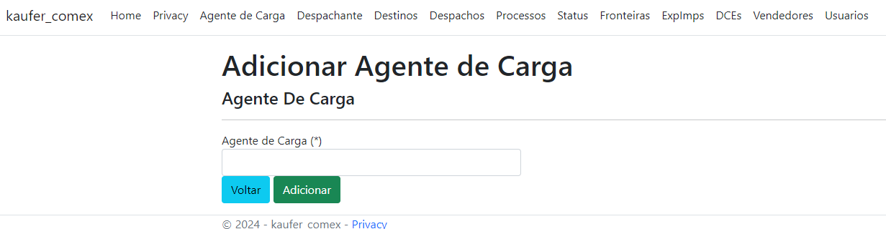
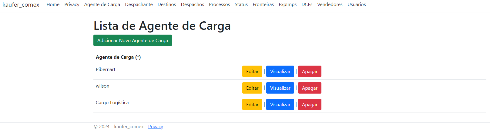

CT-07-Tela Cadastro do Destino
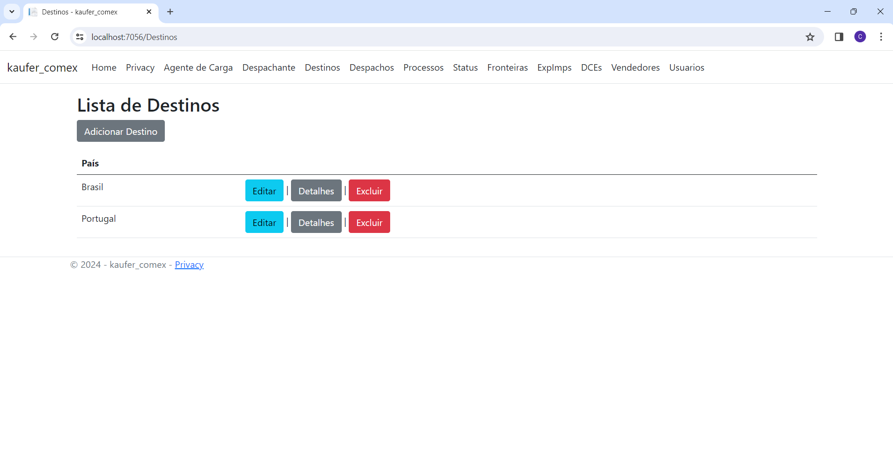

CT-08-Tela Cadastro de Fronteira
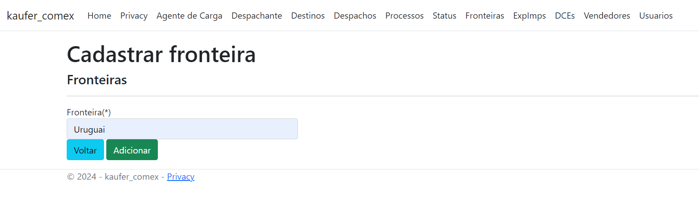
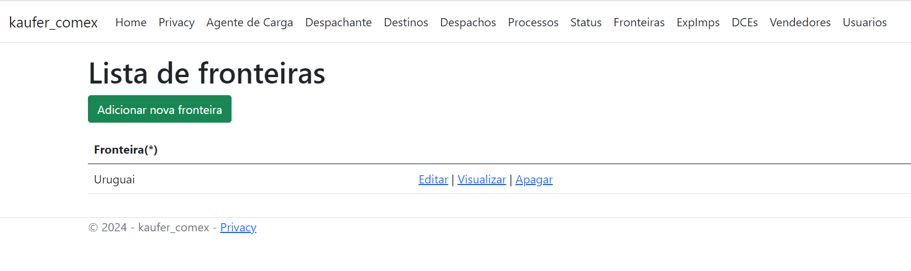

CT-09-Tela Cadastro de despesas
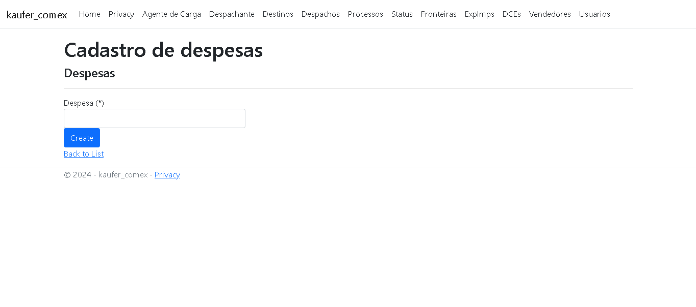
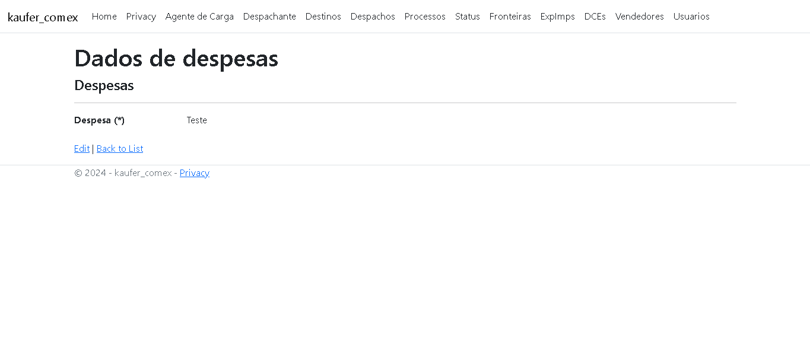

CT-10-Tela Cadastro de fornecedor
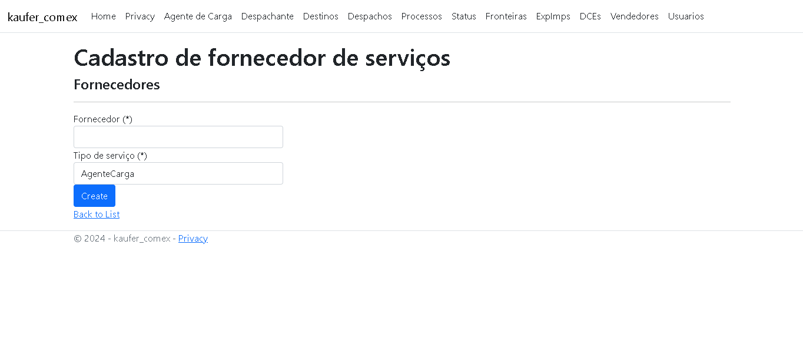
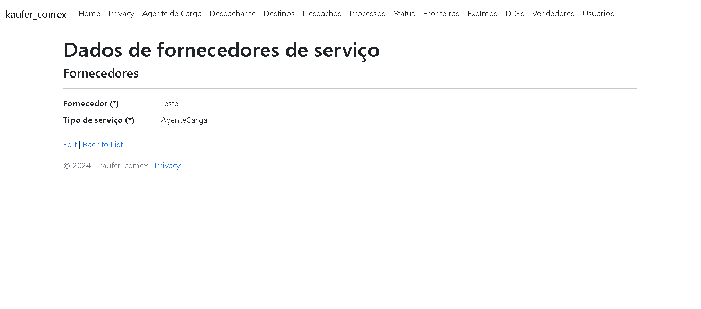

CT-13-Tela Cadastro de DCE
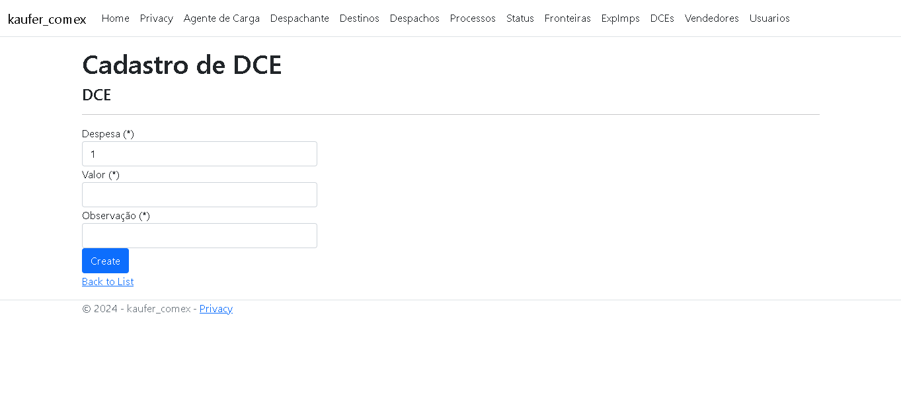
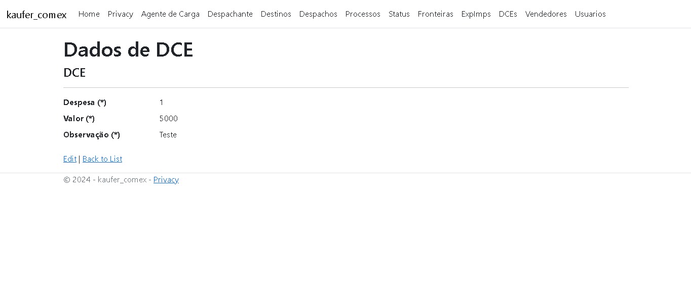

CT-14-Tela Cadastro do Despacho
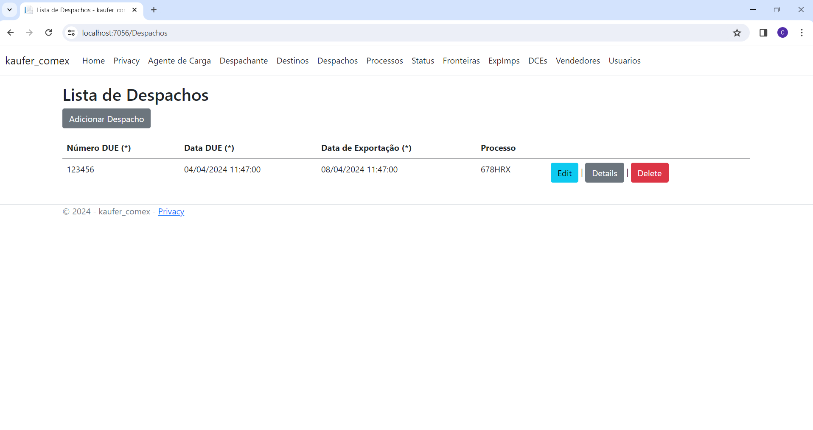

CT-21-Tela Cadastro de Despachante

CT-22- Tela Cadastro de Processo
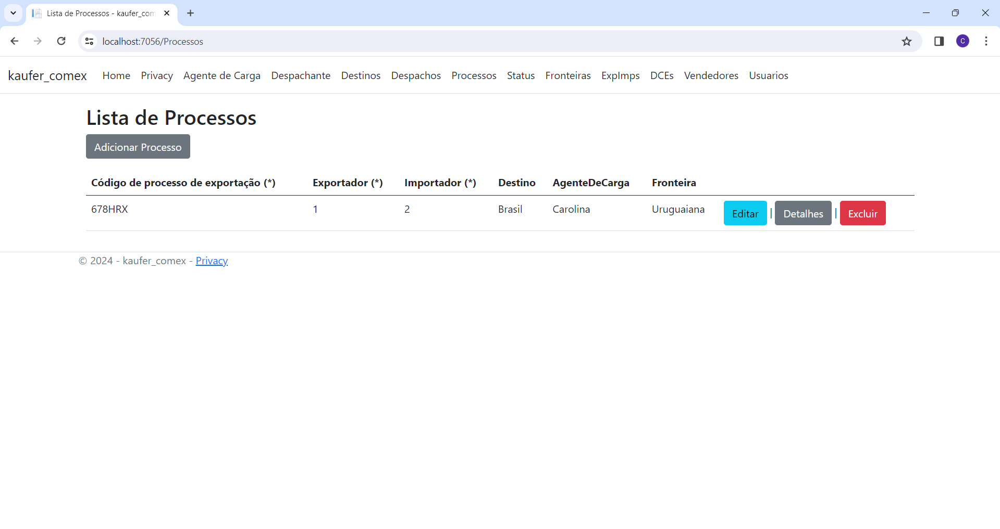

** CT-20- Tela Cadastro de Status 

*** Erro do teste : Editar na página Visualizar não funciona

