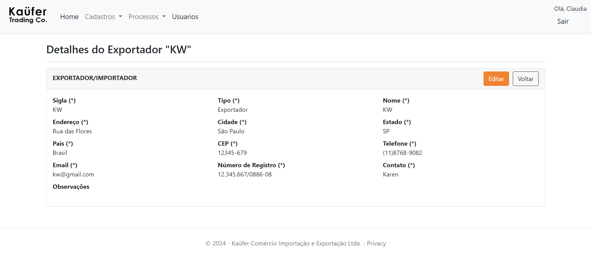

# Planos de Testes de Software

Apresente os cenários de testes utilizados na realização dos testes da sua aplicação. Escolha cenários de testes que demonstrem os requisitos sendo satisfeitos.

Enumere quais cenários de testes foram selecionados para teste. Neste tópico o grupo deve detalhar quais funcionalidades avaliadas, o grupo de usuários que foi escolhido para participar do teste e as ferramentas utilizadas.

| **Caso de teste**   | **CT-01-Tela Login** |
|:---:	|:---:	|
|Requisito Associado |  RF-001 - O sistema deve permitir ao usuário realizar o login.| 
| Objetivo do Teste 	| O usuário deverá realizar o login.|
| Passos 	| - Acessar o aplicativo   - Digitar email e senha   - Clicar no botão 'login' |  
|Critério de Êxito | - Verificar se o usuário conseguiu se conectar a sua conta  .|
|  |  |
| **Caso de teste**   | **CT-02-Tela Cadastro do Usuário** |
|Requisito Associado |  RF-002 - O sistema deve permitir ao gestor cadastrar o usuário. | 
| Objetivo do Teste 	| O Gestor deverá realizar o seu cadastro e o cadastro do colaborador.|
| Passos 	| - Acessar o Site  - Digitar nome, e-mail, senha, CPF, Tipo de Usuário   - Clicar no botão 'Enviar cadastro' |  
|Critério de Êxito | - O cadastro do usuário deve ser realizado.|
|  |  |
| **Caso de teste**   | **CT-03-Tela Cadastro de importador** |
|Requisito Associado |  RF-003 - O sistema deve permitir ao usuário cadastrar o importador. | 
| Objetivo do Teste 	| O usuário deverá realizar o cadastro do importador.|
| Passos 	| - Acessar o Site  - Digitar sigla, tipo, nome, endereço, cidade, estado, país, CEP, Telefone, Email, CNPJ, Contato e observações   - Clicar no botão 'Enviar cadastro' |  
|Critério de Êxito | - O cadastro do importador deve ser realizado.|
|  |  |
| **Caso de teste**   | **CT-04-Tela Cadastro de exportador** |
|Requisito Associado |  RF-004 - O sistema deve permitir ao usuário cadastrar o exportador. | 
| Objetivo do Teste 	| O usuário deverá realizar o cadastro do exportador.|
| Passos 	| - Acessar o Site  - Digitar sigla, tipo, nome, endereço, cidade, estado, país, CEP, Telefone, Email, CNPJ, Contato e observações   - Clicar no botão 'Enviar cadastro' |  
|Critério de Êxito | - O cadastro do exportador deve ser realizado.|
|  |  |
| **Caso de teste**   | **CT-05-Tela Cadastro do Vendedor** |
|Requisito Associado |  RF-005 - O sistema deve permitir ao usuário cadastrar o vendedor.
| Objetivo do Teste 	| O usuário deverá realizar o cadastro do vendedor.|
| Passos 	| - Acessar o Site  - Digitar nome   - Clicar no botão 'Enviar cadastro' |  
|Critério de Êxito | - O cadastro do vendedor deve ser realizado.|
|  |  |
| **Caso de teste**   | **CT-06-Tela Agente de Carga** |
|Requisito Associado |  RF-006 - O sistema deve permitir ao usuário cadastrar o Agente de Carga. | 
| Objetivo do Teste 	| O usuário deverá cadastrar e editar o Agente de Carga.|
| Passos 	| - Acessar o Site  - Fazer o login   - Em cadastro de Agente de Carga digitar a Razão Social   - Clicar no botão 'Enviar cadastro'   - Alterar a Razão Social do Agente de Carga    - Clicar em Editar  |  
|Critério de Êxito | - O cadastro do Agente de Carga deve ser realizado e depois deve ser editado.|
|   |   |
| **Caso de teste**   | **CT-07-Tela Cadastro de Destino** |
|Requisito Associado | RF-007 - O sistema deve permitir ao usuário cadastrar o País de Destino | 
| Objetivo do Teste 	| O usuário deverá cadastrar e editar o País de Destino.|
| Passos 	| - Acessar o Site  - Fazer o login   - Em cadastro de Destino digitar o nome do País   - Clicar no botão 'Enviar cadastro'   - Para editar, acessar a página de edição   - Alterar o nome do País    - Clicar em Editar  |  
|Critério de Êxito | - O cadastro do País de Destino deve ser realizado e depois deve ser editado.|
|   |   |
| **Caso de teste**   | **CT-08-Tela Cadastro de Fronteira** |
|Requisito Associado | RF-008 - O sistema deve permitir ao usuário cadastrar a Fronteira | 
| Objetivo do Teste 	| O usuário deve cadastrar e editar a Fronteira.|
| Passos 	| - Acessar o Site  - Fazer o login   - Em cadastro de Fronteira digitar o nome da fronteira   - Clicar no botão 'Adicionar'   - Para editar, acessar a página de edição   - Alterar o nome da Fronteira    - Clicar em Salvar  |  
|Critério de Êxito | - O cadastro da fronteira deve ser realizado e deve ser permitido a edição|
|   |   |
| **Caso de teste**   | **CT-09-Tela Cadastro de despesas** |
|Requisito Associado |  RF-009 - O sistema deve permitir ao usuário cadastrar as despesas. | 
| Objetivo do Teste 	| O usuário deverá realizar o cadastro de despesas.|
| Passos 	| - Acessar o Site  - Digitar o nome da despesa   - Clicar no botão 'Enviar cadastro' |  
|Critério de Êxito | - O cadastro da despesa deve ser realizado.|
|  |  |
| **Caso de teste**   | **CT-10-Tela Cadastro de fornecedor de serviços** |
|Requisito Associado |  RF-010 - O sistema deve permitir o usuário cadastrar o fornecedor de serviço. | 
| Objetivo do Teste 	| O usuário deverá realizar o cadastro de fornecedor de serviços.|
| Passos 	| - Acessar o Site  - Digitar o nome do fornecedor, tipo de serviço   - Clicar no botão 'Enviar cadastro' |  
|Critério de Êxito | - O cadastro do fornecedor de serviços deve ser realizado.|
| **Caso de teste**   | **CT-11-Tela Cadastro de documentos de exportação** |
|Requisito Associado |  RF-011 - O sistema deve permitir o usuário cadastrar os documentos de exportação. | 
| Objetivo do Teste 	| O usuário deverá realizar o cadastro do documento de exportação.|
| Passos 	| - Acessar o Site  - fazer o login   - Clicar na opção Documentos -Clicar no botão Adicionar documento -Inserir os dados e clicar em cadastrar |  
|Critério de Êxito | - O cadastro do  documento de exportação deverá ser realizado.|
|  |  |
| **Caso de teste**   | **CT-12-Tela Cadastro de Valores** |
|Requisito Associado |  RF-012 - O sistema deve permitir o usuário cadastrar os valores da Exportação.
| Objetivo do Teste 	| O usuário deverá realizar o cadastro dos valores de exportação.|
| Passos 	| - Acessar o Site  - Digitar os valores da exportação   - Clicar no botão 'Enviar cadastro' |  
|Critério de Êxito | - O cadastro dos valores da exportação deve ser realizado.|
|   |   |
| **Caso de teste**   | **CT-13-Tela Cadastro de DCE** |
|Requisito Associado |  RF-013 - O sistema deve permitir que o usuário vincule as despesas com o processo de exportação. | 
| Objetivo do Teste 	| O usuário deverá realizar o cadastro de DCE.|
| Passos 	| - Acessar o Site  - Digitar a despesa, valor e observação   - Clicar no botão 'Enviar cadastro' |  
|Critério de Êxito | - O cadastro da DCE deve ser realizado.|
|  |  |
| **Caso de teste**   | **CT-14-Tela Cadastro de Despacho** |
|Requisito Associado | RF-014 - O sistema deve permitir que o usuário vincule os dados do despacho aduaneiro com o processo de exportação  | 
| Objetivo do Teste 	| O usuário deverá cadastrar e editar os dados do despacho aduaneiro e vincular ao processo de exportação.|
| Passos 	| - Acessar o Site  - Fazer o login   - Em cadastro de Despacho digitar o dados indicados e o código do processo ao qual está vinculado   - Clicar no botão 'Enviar cadastro'   - Para editar, acessar a página de edição   -  Alterar os dados    - Clicar em Editar  |  
|Critério de Êxito | - O cadastro dos dados de despacho deve ser realizado e depois deve ser editado.|
|   |   |
| **Caso de teste**   | **CT-15-Tela Cadastro de Embarque Rodoviário** |
|Requisito Associado | RF-015 - O sistema deve permitir ao usuário cadastrar embarques rodoviários  | 
| Objetivo do Teste 	| O usuário deverá cadastrar os dados do embarque |
| Passos 	| - Acessar o Site  - Fazer o login   - Acessar a opçao Embarque rodoviário   - Clicar no botão Adicionar embarque   -Inserir os dados e clicar no botão cadastrar  |  
|Critério de Êxito | - O cadastro do embarque deve ser realizado |
|   |   |
| **Caso de teste**   | **CT-17-Tela Cadastro de Veículos** |
|Requisito Associado |RF-17 O sistema deve permitir que o usuário vincule veículos com as notas fiscais  | 
| Objetivo do Teste 	| O usuário deverá cadastrar os dados do veículo e vincular a notas fiscais |
| Passos 	| - Acessar o Site  - Fazer o login   - Acessar a opçao veículo   - Clicar no botão Adicionar veiculo   -Inserir os dados e clicar no botão cadastrar - Acessar a opção notas -clicar no botão adicionar nota -selecionar o veículo para cadastrar a nota  |  
|Critério de Êxito | - O cadastro do veículo deve ser realizado e vinculado a notas |
|   |   |
| **Caso de teste**   | **CT-18-Tela Cadastro de Nota** |
|Requisito Associado | RF-018 - O sistema deve permitir que o usuário vincule os itens nas notas fiscais do embarque rodoviário|
| Objetivo do Teste 	| O usuário deverá realizar o cadastro da nota fiscal incluindo os itens cadastrados anteriormente.|
| Passos 	| - Acessar a página de Cadastro de Notas  - Clicar em Adicionar item .   - Selecionar o item e a quantidade do item.   - Clicar em salvar.  - Digitar as informações da Nota e clicar em Cadastrar.|
|Critério de Êxito | - O cadastro da Nota deve ser realizado.|
|   |   |
| **Caso de teste**   | **CT-21-Tela Cadastro de Despachante** |
|Requisito Associado |  RF-021 - O sistema deve permitir ao usuário cadastrar o Despachante.
| Objetivo do Teste 	| O usuário deverá realizar o cadastro do Despachante.|
| Passos 	| - Acessar o Site  - Digitar nome do Despachante   - Clicar no botão 'Enviar cadastro' |  
|Critério de Êxito | - O cadastro do Despachante deve ser realizado.|
|   |   |
| **Caso de teste**   | **CT-22-Tela Cadastro de Processo** |
|Requisito Associado |  RF-022 - O sistema deve permitir ao usuário cadastrar o Processo de exportação.
| Objetivo do Teste 	| O usuário deverá realizar o cadastro dos dados do processo de exportação .|
| Passos 	| - Acessar o Site  - Digitar os dados do processo.   - Clicar no botão 'Enviar cadastro' |  
|Critério de Êxito | - O cadastro do Processo deve ser realizado.|
|   |   |
| **Caso de teste**   | **CT-23-Tela Cadastro de Status** |
|Requisito Associado |  RF-020 - sistema deve permitir ao usuário cadastrar o Status do Processo.
| Objetivo do Teste 	| O usuário deverá realizar o cadastro dos Status .|
| Passos 	| - Acessar o Site  - Digitar o Status.   - Clicar no botão 'Enviar' |  
|Critério de Êxito | - O cadastro do Status deve ser realizado.|
|   |   |
| **Caso de teste**   | **CT-24-Tela teste de lógica valor processo** |
|Requisito Associado |  RF-012 - O sistema deve permitir o usuário cadastrar os valores da Exportação.
| Objetivo do Teste 	| O usuário ao imputar os valores a soma deverá ser realizada automaticamente.|
| Passos 	| - Acessar o Site  - Digitar os valores da exportação   - Clicar no botão 'Enviar cadastro' |  
|Critério de Êxito | - A soma dos valores da exportação deve ser realizado.|
**Caso de teste**   | **CT-25-Tela Embarque Rodoviário** |
|Requisito Associado |  RF-015 - O sistema deve permitir ao usuário cadastrar , deletar e editar embarques rodoviários .
| Objetivo do Teste 	|  O usuário deverá cadastrar os dados do embarque.|
| Passos 	| -  Acessar o Site  - Fazer o login   - Acessar a opçao Embarque rodoviário   - Clicar no botão Adicionar embarque   -Inserir os dados e clicar no botão cadastrar  |  
|Critério de Êxito | - O cadastro do embarque deve ser realizado .|
**Caso de teste**   | **CT-26-Tela Itens** |
|Requisito Associado |  RF-015 - O sistema deve permitir ao usuário cadastre ,edit e delete .
| Objetivo do Teste 	|  O usuário deverá cadastrar os dados do item.|
| Passos 	| -  Acessar o Site  - Fazer o login   - Acessar a opçao Item   - Clicar no botão Adicionar Item   -Inserir os dados e clicar no botão cadastrar  |  
|Critério de Êxito | - O cadastro do Item deve ser realizado 

# Evidências de Testes de Software

Apresente imagens e/ou vídeos que comprovam que um determinado teste foi executado, e o resultado esperado foi obtido. Normalmente são screenshots de telas, ou vídeos do software em funcionamento.

CT-02-Tela Cadastro do Usuário

CT-03 e 04-Tela Cadastro de importador e exportador

CT-05-Tela Cadastro do Vendedor

CT-06-Tela Agente de Carga

CT-07-Tela Cadastro do Destino

|**Caso de teste**   | **CT- -Tela Destino**- Realizar Cadastro de Destino, Editar ,Visualizar detalhes e Excluir .|
|:---:	|:---:	|
|Requisito Associado |   RF-007 - O sistema deve permitir ao usuário cadastrar o País de Destino .|
|Página realizada por : | Cláudia |
| Teste Realizado por: 	|  Josyane |
|Pré-condições :| Estar logado no sistema e acessar a página index de Destino. |
| Passos 	|  1)	Clicar no botão adicionar Destino 2)	Adicionar o dado do Destino  3)	Clicar em cadastrar 4)	Voltar automaticamente  para a index  5)	Clicar no botão editar  6)	Editar Destino 7)	Voltar para a tela index de Destino 8)	Clicar em detalhes  9)	Visualizar detalhes do Destino  10)	Clicar em editar 11)	Ir para a página editar 12)	No botão voltar da página editar voltar para  index de Destino 13)	Excluir Destino 14)	Botão de voltar em excluir vai para index de Destino|  
|Resultado esperado:| O usuário deve cadastrar o Destino clicando no botão adicionar Destino dentro da página index . Após isso, deve voltar para a tela index e clicar em Editar . Conseguir editar um Destino e retornar a index.Botão de detalhes mostrar dados de Determinado Destino. Usuário Exclui determinado Destino.|
|Dados de Entrada| Certificado de origem, Certificado do Seguro,Envio do Certificado de origem,Tracking,Courier|
|Resultados Obtidos|Foi possível Cadastrar, Editar , Visualizar  Destino e Excluir , conforme demostrado. 
Ao clicar no botão Cadastrar com os dados dos inputs vazios o sistema não realiza o cadastro e mostra as mensagens informando que os dados são requeridos. A única observação é que em Editar o botão está escrito Cadastrar.A mensagem de requerido está em inglês : The País field is required.A navegação pelos botões corresponde as respectivas páginas indicadas.|

CT-08-Tela Cadastro de Fronteira

CT-09-Tela Cadastro de despesas

CT-10-Tela Cadastro de fornecedor

 ## CT-11-Tela Cadastro de documentos

|**Caso de teste**   | **CT- -Tela Documentos**- Realizar Cadastro de Documentos, Editar ,Visualizar detalhes e Excluir .|
|:---:	|:---:	|
|Requisito Associado |  RF-015 - O sistema deve permitir ao usuário cadastrar , deletar e editar Documentos do Processo.|
|Página realizada por : | Carolina |
| Teste Realizado por: 	|  Josyane |
|Pré-condições :| Estar logado no sistema   acessar detalhes do processo e clicar no botão cadastrar para realizar o cadastro do Documento do Processo. |
| Passos 	|  1)	Clicar no botão adicionar Documento 2)	Adicionar o dado do Documento 3)	Clicar em cadastrar 4)	Voltar automaticamente  para a index  5)	Clicar no botão editar  6)	Editar Documento 7)	Voltar para a tela Detalhes do Processo 8)	Clicar em detalhes  9)	Visualizar detalhes  10)	Clicar em editar 11)	Ir para a página editar 12)	No botão voltar da página editar voltar para Detalhes do Processo 13)	Excluir Documento 14)	Botão de voltar em excluir vai para Detalhes do Processo|  
|Resultado esperado:| O usuário deve cadastrar o Documento clicando no botão adicionar Documento dentro da página de Detalhes do Processo. Após isso, deve voltar para a tela de Detalhes do Processo e clicar em Editar . Conseguir editar um Documento e retornar a Detalhes do Processo.Botão de detalhes mostrar dados de Determinado Documento. Usuário Exclui determinado  documento do processo.|
|Dados de Entrada| Certificado de origem, Certificado do Seguro,Envio do Certificado de origem,Tracking,Courier|
|Resultados Obtidos|Foi possível Cadastrar, Editar , Visualizar  Destino e Excluir , conforme demostrado. Ao clicar no botão Cadastrar com os dados dos inputs vazios o sistema não realiza o cadastro e mostra as mensagens informando que os dados são requeridos. A única observação é que a mensagem de requerido em Courier está como : The Courier (*) field is required.Botão voltar em Details volta para a index de Documento e não para Detalhes do processo.Editar não retorna os dados da data.Em Details  e em Delete, Courier está abaixo de Tracking Courier e não do lado.A navegação pelos botões corresponde as respectivas páginas indicadas.|

CT-13-Tela Cadastro de DCE

CT-14-Tela Cadastro do Despacho

CT-15-Tela Cadastro de Embarque rodoviário

CT-18-Tela Cadastro de Nota

*** Erro de teste ao implementar o Cadastro de Nota

CT-21-Tela Cadastro de Despachante

CT-22- Tela Cadastro de Processo

** CT-23- Tela Cadastro de Status 

** CT-17- Tela Cadastro Veículos

** CT-18- Tela Cadastro Itens

*** Erro do teste : Faltava um atributo na tabela para cilindro ,além disso não o cálculo é multiplicado o e não somado como realizado abaixo. 

CT-22- Tela Cadastro de Processo

## Testes de Software - Etapa 4

**CT-08 - Cadastro de fronteiras**
|**Caso de teste**   | **CT- 08 -Tela Fronteira**- Realizar Cadastro de Despesas, Editar ,Visualizar detalhes e Excluir .|
|:---:	|:---:	|
|Requisito Associado |  RF-008 - O sistema deve permitir ao usuário cadastrar a Fronteira.|
|Página realizada por: | Carolina |
| Teste Realizado por: 	| Karen  |
|Pré-condições :| Estar logado no sistema   acessar o link Cadastros, Clicar em Fronteira e clicar no botão Adicionar fronteira para realizar o cadastro.|
| Passos 	|  1)	Clicar no botão adicionar fronteira 2)	Adicionar dados 3)	Clicar em cadastrar 4)	Voltar automaticamente  para a index  5)	Clicar no botão editar  6)	Editar Despesa 7)Clicar em detalhes  9)	Visualizar detalhes  10)	Clicar em editar 11)	Ir para a página editar 12)	No botão voltar da página editar voltar para o Index 13)	Excluir Despesa 14)	Botão de voltar em excluir vai para o Index de despesas|  
|Resultado esperado:| O usuário deve cadastrar a fronteira clicando no botão adicionar Despesa. Após isso, deve voltar para a tela index e clicar em Editar . Conseguir editar o cadastro e retornar a index.Botão de detalhes mostrar dados da fronteira cadastrada. Usuário Exclui despesa selecionada.|
|Dados de Entrada| Nome da fronteira|
|Resultados Obtidos|Foi possível Cadastrar, Editar , Visualizar  detalhes e Excluir , conforme demostrado. A navegação pelos botões corresponde as respectivas páginas indicadas.|

**CT-09 - Cadastro de despesas**
|**Caso de teste**   | **CT- 09 -Tela Despesas**- Realizar Cadastro de Despesas, Editar ,Visualizar detalhes e Excluir .|
|:---:	|:---:	|
|Requisito Associado |  RF-009 - O sistema deve permitir ao usuário cadastrar as despesas.|
|Página realizada por: | Douglas |
| Teste Realizado por: 	|  Carolina |
|Pré-condições :| Estar logado no sistema   acessar o link Cadastros, Clicar em Despesas e clicar no botão Adicionar despesa para realizar o cadastro.|
| Passos 	|  1)	Clicar no botão adicionar despesa 2)	Adicionar dados 3)	Clicar em cadastrar 4)	Voltar automaticamente  para a index  5)	Clicar no botão editar  6)	Editar Despesa 7)Clicar em detalhes  9)	Visualizar detalhes  10)	Clicar em editar 11)	Ir para a página editar 12)	No botão voltar da página editar voltar para o Index 13)	Excluir Despesa 14)	Botão de voltar em excluir vai para o Index de despesas|  
|Resultado esperado:| O usuário deve cadastrar a despesa clicando no botão adicionar Despesa. Após isso, deve voltar para a tela index e clicar em Editar . Conseguir editar o cadastro e retornar a index.Botão de detalhes mostrar dados da despesa cadastrada. Usuário Exclui despesa selecionada.|
|Dados de Entrada| Nome da despesa|
|Resultados Obtidos|Foi possível Cadastrar, Editar , Visualizar  detalhes e Excluir , conforme demostrado. A navegação pelos botões corresponde as respectivas páginas indicadas.|

**CT-10 - Cadastro de Fornecedor de serviço**
|**Caso de teste**   | **CT- 10 -Tela Fornecedor**- Realizar Cadastro de Fornecedores de serviço, Editar ,Visualizar detalhes e Excluir .|
|:---:	|:---:	|
|Requisito Associado |  RF-010 - O sistema deve permitir o usuário cadastrar o fornecedor de serviço|
|Página realizada por : | Douglas |
| Teste Realizado por: 	|  Carolina |
|Pré-condições :| Estar logado no sistema   acessar o link Cadastros, Clicar em Fornecedor e clicar no botão Adicionar fornecedor de serviço para realizar o cadastro.|
| Passos 	|  1)	Clicar no botão adicionar fornecedor de serviço 2)	Adicionar dados 3)	Clicar em cadastrar 4)	Voltar automaticamente  para a index  5)	Clicar no botão editar  6)	Editar fornecedor 7)Clicar em detalhes  9)	Visualizar detalhes  10)	Clicar em editar 11)	Ir para a página editar 12)	No botão voltar da página editar voltar para o Index 13)	Excluir fornecedor 14)	Botão de voltar em excluir vai para o Index|  
|Resultado esperado:| O usuário deve cadastrar o fornecedor clicando no botão adicionar fornecedor de serviço. Após isso, deve voltar para a tela index e clicar em Editar . Conseguir editar o cadastro e retornar a index.Botão de detalhes mostrar dados da fornecedor cadastrado. Usuário Exclui fornecedor selecionado.|
|Dados de Entrada| Fornecedor, Tipo de serviço|
|Resultados Obtidos|Foi possível Cadastrar, Editar , Visualizar  detalhes e Excluir , conforme demostrado. A navegação pelos botões corresponde as respectivas páginas indicadas.|

**CT-12 - Cadastro de Valores do processo**
|**Caso de teste**   | **CT- 12 -Tela Valores**- Realizar Cadastro dos valores do processo, Editar ,Visualizar detalhes e Excluir .|
|:---:	|:---:	|
|Requisito Associado |  RF-012 - O sistema deve permitir o usuário cadastrar os valores da Exportação|
|Página realizada por : | Jeferson |
| Teste Realizado por: 	|  Carolina |
|Pré-condições :| Estar logado no sistema   acessar a página de detalhes do processo, Clicar em Valores e clicar no botão Cadastrar para realizar o cadastro.|
| Passos 	|  1)	Acessar a página de detalhes do processo no qual deseja cadastrar os valores, Clicar no botão Valores 2)	Adicionar dados 3)	Clicar em cadastrar 4)	Voltar automaticamente  para a página de detalhes do processo  5)	Clicar no botão editar  6)	Editar valores 7)Clicar em detalhes  9)	Visualizar detalhes  10)	Clicar em editar 11)	Ir para a página editar 12)	No botão voltar da página editar voltar para detalhes do processo 13)	Excluir valores 14)	Botão de voltar em excluir vai para detalhes do processo|  
|Resultado esperado:| O usuário deve cadastrar os valores relativos ao processo clicando no botão adicionar valores, e o sistema deve realizar a soma de todos os valores informados. Após isso, deve voltar para a tela detalhes do processo e clicar em Editar . Conseguir editar o cadastro e retornar a página de detlhes do processo.Botão de detalhes mostrar dados dos valores cadastrados. Usuário Exclui valores.|
|Dados de Entrada| Moeda,Valor Exw, Valor Fob/Fca,Frete internacional,Seguro internacional, Valor total.|
|Resultados Obtidos|Foi possível Cadastrar, Editar , Visualizar  detalhes e Excluir , conforme demostrado. A navegação pelos botões corresponde as respectivas páginas indicadas. Há um erro na formatação dos valores, fazendo com que o valor total fique incorreto|

**CT- 22 - Cadastro de Processo**
|**Caso de teste**   | **CT- 22 -Tela Processo**- Realizar Cadastro dos processos, Editar ,Visualizar detalhes e Excluir .|
|:---:	|:---:	|
|Requisito Associado |  RF-022 - O sistema deve permitir ao usuário cadastrar o Processo de exportação.|
|Página realizada por : | Claudia|
| Teste Realizado por: 	| Karen |
|Pré-condições :| - Estar logado no sistema   - Clicar em Home e clicar no botão Cadastrar para realizar o cadastro.|
| Passos 	|  1)	Acessar a página HOME  2)	Clicar em adicionar e realizar o cadastro  3)	Voltar automaticamente  para a página de Lista de Processos após concluir cadastro  4)	Clicar no botão editar  5)	Editar dados do Processo 6)Clicar em detalhes  7)	Visualizar detalhes  8)	Clicar em voltar 9)	Ir para a página Lista de Processos 10)	Excluir processo 14)	Voltar automaticamente para lista de Processo. |  
|Resultado esperado:| O usuário deve conseguir cadastrar, editar, excluir e visualizar os dados do processo|
|Resultados Obtidos|Foi possível Cadastrar, Editar , Visualizar  detalhes e Excluir , conforme demostrado. A navegação pelos botões corresponde as respectivas páginas indicadas.|

**CT- 23 - Cadastro de Veículos**
|**Caso de teste**   | **CT- 23 -Tela Veículos**- Realizar Cadastro dos valores do processo, Editar ,Visualizar detalhes e Excluir .|
|:---:	|:---:	|
|Requisito Associado |  RF-023 - O sistema deve permitir o usuário cadastrar o veículo|
|Página realizada por : | Josyane |
| Teste Realizado por: 	|  Carolina |
|Pré-condições :| Estar logado no sistema   acessar a página de detalhes do processo, Clicar em Veículo e clicar no botão Cadastrar para realizar o cadastro.|
| Passos 	|  1)	Acessar a página de detalhes do processo no qual deseja cadastrar o veículo, Clicar no botão Veículo 2)	Adicionar dados 3)	Clicar em cadastrar 4)	Voltar automaticamente  para a página de detalhes do processo  5)	Clicar no botão editar  6)	Editar dados do veículo 7)Clicar em detalhes  9)	Visualizar detalhes  10)	Clicar em editar 11)	Ir para a página editar 12)	No botão voltar da página editar voltar para detalhes do processo 13)	Excluir veículo 14)	Botão de voltar em excluir vai para detalhes do processo|  
|Resultado esperado:| O usuário deve cadastrar os dados do veículo relativos ao processo clicando no botão Veículos. Após isso, deve voltar para a tela detalhes do processo e clicar em Editar . Conseguir editar o cadastro e retornar a página de detlhes do processo.Botão de detalhes mostrar dados dos veículos cadastrados. Usuário Exclui veículos.|
|Dados de Entrada| Placa, Motorista|
|Resultados Obtidos|Foi possível Cadastrar, Editar , Visualizar  detalhes e Excluir , conforme demostrado. A navegação pelos botões corresponde as respectivas páginas indicadas.|

**CT-23- Tela Embarque Rodoviário**

**CT-23- Tela Itens**

**CT-13 - Tela Cadastro de DCE**
|**Caso de teste**   | **CT- 09 -Tela DCE**- Realizar Cadastro de DCE, Editar ,Visualizar detalhes e Excluir .|
|:---:	|:---:	|
|Requisito Associado | RF-013 - O sistema deve permitir que o usuário vincule as despesas com o processo de exportação. |
|Página realizada por : | Douglas |
| Teste Realizado por: 	|  Cláudia |
|Pré-condições :| Estar logado no sistema   Clicar para ver detalhes do processo, Clicar em DCE e realizar o cadastro.|
| Passos 	|  1) Adicionar dados  2)Clicar em Adicionar despesa e repetir o processo se necessário  3)Após adicionar todas as despesas, clicar em Salvar as despesas  4)Voltar automaticamente  para a index  5)Clicar no botão de editar 6)Editar dados  7)No botão voltar da página editar voltar para o Index  8)Excluir Despesa 9)	Botão de voltar em excluir vai para o Index de DCE|  
|Resultado esperado:| O usuário deve cadastrar DCE clicando no botão Salvar todas as despesas. Após isso, deve voltar para a tela index e clicar em Editar . Conseguir editar o cadastro e retornar a index. Botão de detalhes mostrar dados da DCE cadastrada. Usuário Exclui DCE selecionada.|
|Dados de Entrada| Despesa, Valor, Fornecedor, Observação |
|Resultados Obtidos|Foi possível Cadastrar, Editar , Visualizar  detalhes e Excluir , conforme demostrado. A navegação pelos botões corresponde as respectivas páginas indicadas.|

.png)

**CT-23-Tela Cadastro de Status** 
|**Caso de teste**   | **CT- 09 -Tela Status**- Realizar Cadastro de Status, Editar ,Visualizar detalhes e Excluir .|
|:---:	|:---:	|
|Requisito Associado |  RF-020 - sistema deve permitir ao usuário cadastrar o Status do Processo. |
|Página realizada por : | Josyane |
| Teste Realizado por: 	|  Cláudia |
|Pré-condições :| Estar logado no sistema   acessar o link Cadastros, Clicar em Status e clicar no botão Adicionar Status para realizar o cadastro.|
| Passos 	|  1)Clicar no botão adicionar status 2)	Adicionar dados 3)Clicar em cadastrar 4)Voltar automaticamente  para a index  5)	Clicar no botão editar  6)Editar status 7)Clicar em detalhes  9)Visualizar detalhes  10)	Clicar em editar 11)	Ir para a página editar 12)	No botão voltar da página editar voltar para o Index 13)	Excluir Status 14)Botão de voltar em excluir vai para o Index de status|  
|Resultado esperado:| O usuário deve cadastrar o status clicando no botão adicionar Status. Após isso, deve voltar para a tela index e clicar em Editar . Conseguir editar o cadastro e retornar a index.Botão de detalhes mostrar dados do status cadastrada. Usuário Exclui status selecionado.|
|Dados de Entrada| Nome do Status|
|Resultados Obtidos|Foi possível Cadastrar, Editar , Visualizar  detalhes e Excluir , conforme demostrado. A navegação pelos botões corresponde as respectivas páginas indicadas.|

**CT-03-Tela Cadastro de Exportador/Importador**
|**Caso de teste**   | **CT- 09 -Tela Exportador/Importador**- Realizar Cadastro de Exportador/Importador, Editar ,Visualizar detalhes e Excluir .|
|:---:	|:---:	|
|Requisito Associado |  RF-003 - O sistema deve permitir ao usuário cadastrar o importador. - RF-004 - O sistema deve permitir ao usuário cadastrar o exportador. |
|Página realizada por : | Douglas |
| Teste Realizado por: 	|  Cláudia |
|Pré-condições :| Estar logado no sistema   acessar o link Cadastros, Clicar em Exportador/Importador e clicar no botão Adicionar Exportador/Importador para realizar o cadastro.|
| Passos 	|  1)Clicar no botão adicionar Exportador/Importador 2)Adicionar dados 3)	Clicar em cadastrar 4)Voltar automaticamente  para a index  5)	Clicar no botão editar  6)Editar Exportador/Importador 7)Clicar em detalhes  9)	Visualizar detalhes  10)	Clicar em editar 11)	Ir para a página editar 12)	No botão voltar da página editar voltar para o Index 13)	Excluir Exportador/Importador 14)Botão de voltar em excluir vai para o Index de Exportador/Importador|  
|Resultado esperado:| O usuário deve cadastrar Exportador/Importador clicando no botão adicionar Exportador/Importador. Após isso, deve voltar para a tela index e clicar em Editar . Conseguir editar o cadastro e retornar a index.Botão de detalhes mostrar dados do Exportador/Importador cadastrado. Usuário Exclui Exportador/Importador selecionado.|
|Dados de Entrada| Sigla, tipo, nome, endereço, cidade, estado, país, CEP, Telefone, Email, CNPJ, Contato e observações|
|Resultados Obtidos|Foi possível Cadastrar, Editar , Visualizar  detalhes e Excluir , conforme demostrado. A navegação pelos botões corresponde as respectivas páginas indicadas.|

